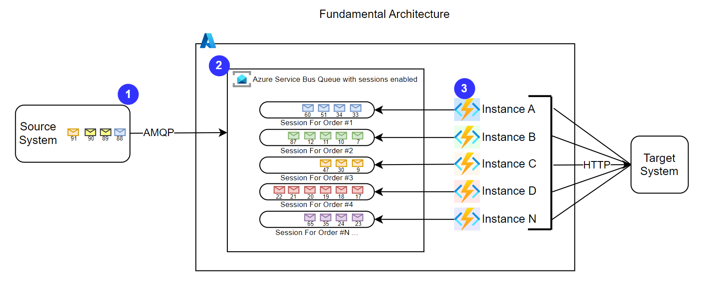
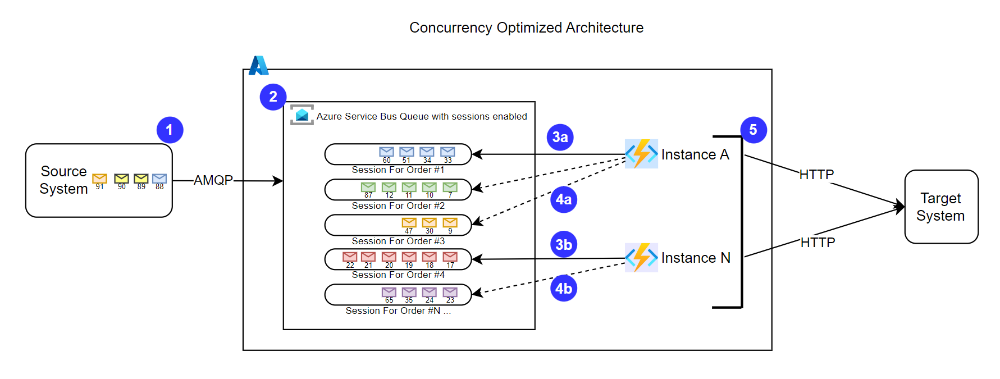

Azure Functions offers a very convenient way to consume an Azure Service Bus (ASB) queue with a high degree of parallelism right out of the box. However, there are situations where a bit of tunning and customization can go a long way. This article was inspired by a real-world systems integration project.

## Context & Requirements
 A source system publishes sales order messages using the AMQP protocol to an ASB queue. The target system can only ingest data via a synchronous RESTful API. Messages belonging to the same sales order must be delivered to the target system in the order they were published to the queue. Messages from different sales orders may be processed out of order. On the surface this appears to be a straight forward integrations. 

A queue with [sessions](https://learn.microsoft.com/en-us/azure/service-bus-messaging/message-sessions) enabled will guarantee the messages stay in order relative to the sales order id. An Azure Function will be utilized to deliver the messages from the queue to the target system. The [ASB function trigger](https://learn.microsoft.com/en-us/azure/azure-functions/functions-bindings-service-bus-trigger?tabs=python-v2%2Cisolated-process%2Cnodejs-v4%2Cextensionv5&pivots=programming-language-csharp) will make sure the messages will be processed shortly after they land on the queue.



| Step | Description                                                                                                     |
| :--- | :-------------------------------------------------------------------------------------------------------------- |
| 1    | Source system publishes messages                                                                                |
| 2    | Azure Service Bus with sessions enabled automatically groups messages into sessions based on the sales order id |
| 3    | Azure Functions runtime scales out by launching more instances to cope with the number of sessions.             |

## The Challenge
Early in development it was obvious something wasn't right. Each function invocation was taking an average of 30 seconds to process the contents of a session, whereas the expectation was something in the range of 1 second or less. After adding some instrumentation via custom logs and metrics it was discovered that the function was sitting idle 99% of the time. It would only take the function a few milliseconds to arrange the messages in the session and submit the API request to the target system. However, the target system would take roughly 30 seconds to respond.

If the target system offered an asynchronous API such as a webhook or a callback this latency would not be difficult to manage. Changing the behavior of the target system was not a viable option at the time. So as the saying goes, you have to work with what you have.

## Hasty Solution
Increasing the [maximum number](https://learn.microsoft.com/en-us/azure/azure-functions/functions-concurrency#static-concurrency) of function instances would provide a measure of increased throughput but would prove very inefficient and potentially costly.

## Optimize for Concurrency
### A bit more context
The queue has sessions enabled, so when the function is triggered the Azure function runtime provides our code with an implicit session lock to a single session along with a collection of the messages in the session. Normally the function would process the messages in the collection and as long as the function completes successfully the function runtime will release the lock on the session. But what if we could processes multiple sessions in a single function invocation?

### Multi-tasking
We know the function is idle for the best part of 30 seconds. Let's put that idle compute time to use. Once the function is triggered it takes only a few milliseconds to arrange and submit the messages provided by the function trigger. Immediately after our function submits the original messages to the target system it could request more work from ASB using asynchronous coding patterns. The function could request multiple session locks and processes many messages in parallel while it's waiting for the original request to complete. With some tunning we can find the optimum number of sessions that a single function instance can processes within the latency window of the target system. The fundamental architecture now looks like the following:



| Step  | Description                                                                                                                                                        |
| :---- | :----------------------------------------------------------------------------------------------------------------------------------------------------------------- |
| 1     | Source system publishes messages                                                                                                                                   |
| 2     | Azure Service Bus with sessions enabled automatically groups messages into sessions based on the sales order id                                                    |
| 3a+3b | Azure Functions runtime scales out by launching more instances to cope with the number of sessions.                                                                |
| 4a+4b | Each function acquires N number of additional sessions locks while it is waiting for the target system to respond.                                                 |
| 5     | Each function instance still spends the majority of the time idle but now we are maximizing concurrency and thus increasing throughput and reducing over all cost. |

## Code Sample

Below is an simplified code sample of how one could accomplish the solution described above. Note the code below processes three sessions in addition to the primary session provided by the ASB trigger. That alone would be a major performance gain. In practice you will want to perform some load testing to determine the optimal number of concurrent sessions for your particular application.

```cs
using Azure.Identity;
using Azure.Messaging.ServiceBus;
using Microsoft.Azure.Functions.Worker;
using Microsoft.Extensions.Logging;

namespace Company.Function
{
    public class SalesOrderSubscriber
    {
        private readonly ILogger<SalesOrderSubscriber> _logger;

        public SalesOrderSubscriber(ILogger<SalesOrderSubscriber> logger)
        {
            _logger = logger;
        }

        [Function(nameof(SalesOrderSubscriber))]
        public async Task Run(
            [ServiceBusTrigger("sales_order", Connection = "sales_order_SERVICEBUS", IsSessionsEnabled = true, IsBatched = true)]
            ServiceBusReceivedMessage[] messages,
            ServiceBusMessageActions messageActions)
        {

            var PrimarySessionTask = PostOrderToTargetSystem(messages);

            var defCredentials = new DefaultAzureCredential();
            var SecondSessionTask = SubSessionProcessor(defCredentials);
            var ThirdSessionTask = SubSessionProcessor(defCredentials);
            var NthSessionTask = SubSessionProcessor(defCredentials);

            await Task.WhenAll(PrimarySessionTask, SecondSessionTask, ThirdSessionTask, NthSessionTask);
        }

        public async Task SubSessionProcessor(DefaultAzureCredential credentials)
        {
            await using var client = new ServiceBusClient(Environment.GetEnvironmentVariable("sales_order_fullyQualifiedNamespace"), credentials);
            ServiceBusSessionReceiver receiver = await client.AcceptNextSessionAsync("sales_order");
            ServiceBusReceivedMessage receivedMessage;
            List<ServiceBusReceivedMessage> messages = new List<ServiceBusReceivedMessage>();

            receivedMessage = await receiver.ReceiveMessageAsync(TimeSpan.FromMilliseconds(500));
            while (receivedMessage != null)
            {
                messages.Add(receivedMessage);
                receivedMessage = await receiver.ReceiveMessageAsync(TimeSpan.FromMilliseconds(500));
            }

            await PostOrderToTargetSystem(messages);

            foreach (var message in messages)
            {
                await receiver.CompleteMessageAsync(message);
            }
            await receiver.CloseAsync();

        }
        public async Task PostOrderToTargetSystem(IEnumerable<ServiceBusReceivedMessage> messages)
        {
            _logger.LogInformation("Order posted to target system");
        }

    }
}

```

## Conclusion
In the real-world we were able to optimize the throughput of each function instance by a factor 100. In other words, for every function invocation that lasted 30 seconds we were able to process the contents of 100 sessions instead of only one session. I encourage you to take a closer look at your function implementation, you never know nugget of optimization you may find.

